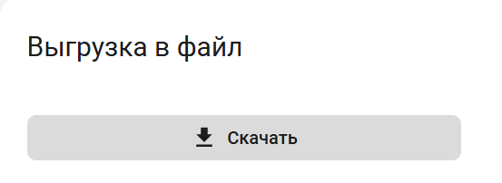
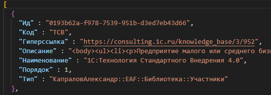

# Выгрузка в файл

Администратору приложения доступна возможность выгрузить данные приложения в json формате.
Указанная возможность предназначена для интеграции с другими системами или передачи списка технологий и процессов в другую копию приложения.








