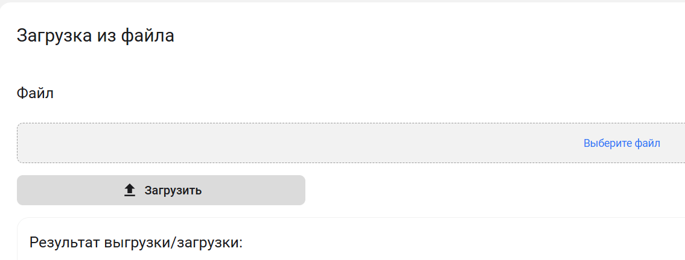

# Загрузка из файла

Администратору приложения доступна возможность загрузить данные приложения из json формата.
Указанная возможность предназначена для интеграции с другими системами или получения списка технологий и процессов из другой копии приложения.





После нажатия кнопки *Загрузить* будет выведен лог результатов загрузки.