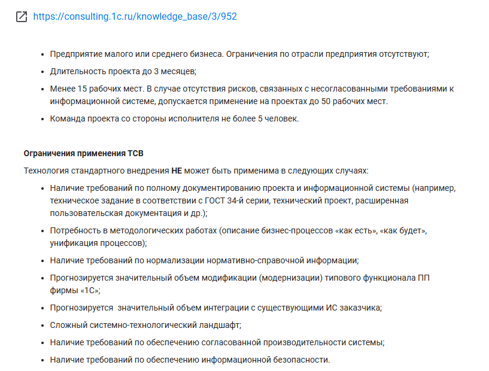

# Технологии

Форма содержит информацию обо всех технологиях, входящих в 1С:СМК.

Для каждой технологии указана ссылка на сайт consulting.1c.ru с её описанием.

В качестве описания технологии указана выжимка из чеклиста, на основании которого необходимо выбрать указанную технологию при внедрении.

