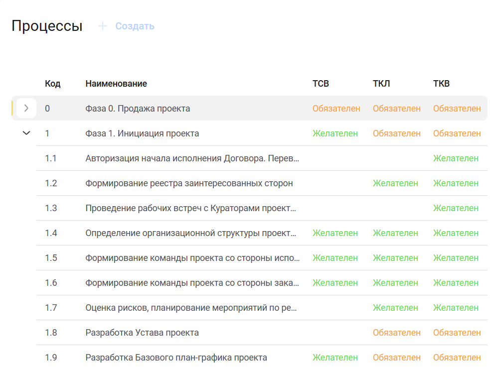
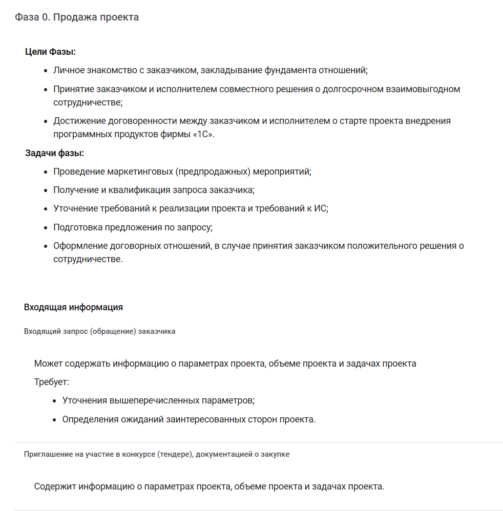
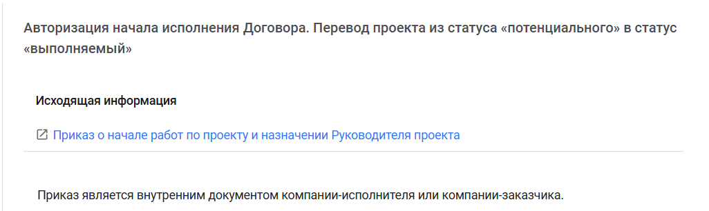

# Процессы

Форма содержит древовидную структуру процессов.



Запрещен
: Указанный процесс запрещено использовать.

Желателен
: Указанный процесс рекомендуется использовать, но можно пропустить.

Обязателен
: указанный процесс обязателен для использования.







На первом уровне выводятся фазы. Для каждой фазы указаны её цели, задачи и список входящей информации.





Для каждого процесса внутри фазы выводится гиперссылка на шаблон документа на сайте consulting.1c.ru и описание самого процесса.




